# 🎯 Food Ordering Appointment System

This repository contains the **Admin Panel** and **API** for managing food ordering appointments with a food store. The system is designed to streamline appointment scheduling and order management, providing both administrative tools and API functionality for frontend integration.

---

## Features

### Admin Panel
- **User-friendly Dashboard**: Manage food categories, products, and orders efficiently.
- **Order Management**: Track and confirm orders with status updates.
- **Reports**: Generate detailed reports for orders and appointments.
- **Role Management**: Control access based on user roles (Admin/Staff).

### API
- **Authentication**: Secure user login using JWT.
- **CRUD Operations**: Handle products, categories, and orders programmatically.
- **Order Management**: APIs for creating, updating, and viewing orders.
- **Real-Time Features**: Appointment scheduling and order tracking.

---

## Installation

### Requirements
- PHP >= 8.0
- Laravel Framework
- MySQL Database
- Node.js & npm (for frontend assets)

### Steps
1. Clone the repository:
   ```bash
   git clone https://github.com/naufalfirman23/System-Order-for-Restaurant-Admin-and-API.git
2. Navigate to the project directory:
    ```bash
    cd food-ordering-system
4. Install dependencies:
   ```bash
    composer install
    npm install
    npm run dev
5. Configure the .env file with your database and environment details.
6. download sql file on : [Download!](https://api.whatsapp.com/send/?phone=6282265057386&text&type=phone_number&app_absent=0)   
8. Start the server:
   ```bash
   php artisan serve
   
### API Endpoints
# API Documentation

## Endpoints

| **Endpoint**                 | **Method** | **Description**                                                                                  | **Middleware**       |
|-------------------------------|------------|--------------------------------------------------------------------------------------------------|----------------------|
| `/register`                  | POST       | Register a new user by providing details like name, email, and password.                        | -                    |
| `/login`                     | POST       | Log in the user to obtain an authentication token.                                              | -                    |
| `/test`                      | GET        | A test endpoint to verify API connectivity or response.                                         | -                    |
| `/logout`                    | POST       | Logs out the user by invalidating the authentication token.                                     | `auth:sanctum`       |
| `/user`                      | GET        | Retrieves the details of the currently logged-in user.                                          | `auth:sanctum`       |
| `/category`                  | GET        | Fetches a list of all product categories.                                                       | `auth:sanctum`       |
| `/kategori/pesanan`          | GET        | Fetches all order categories.                                                                   | `auth:sanctum`       |
| `/products-by-category`      | GET        | Fetches products filtered by a specific category.                                               | `auth:sanctum`       |
| `/products-detail/{id}`      | GET        | Retrieves product details based on the product ID.                                              | `auth:sanctum`       |
| `/orders/`                   | GET        | Fetches a list of all orders made by the logged-in user.                                        | `auth:sanctum`       |
| `/orders/{id}`               | GET        | Fetches the details of a specific order by its ID.                                              | `auth:sanctum`       |
| `/orders/`                   | POST       | Creates a new order based on product and category data.                                         | `auth:sanctum`       |
| `/orders/terima`             | POST       | Marks a specific order as received by the user.                                                 | `auth:sanctum`       |
| `/order-history`             | GET        | Fetches the history of all orders made by the user.                                             | `auth:sanctum`       |

<!-- Images start here -->
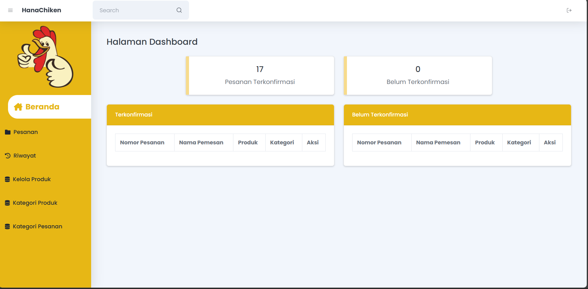

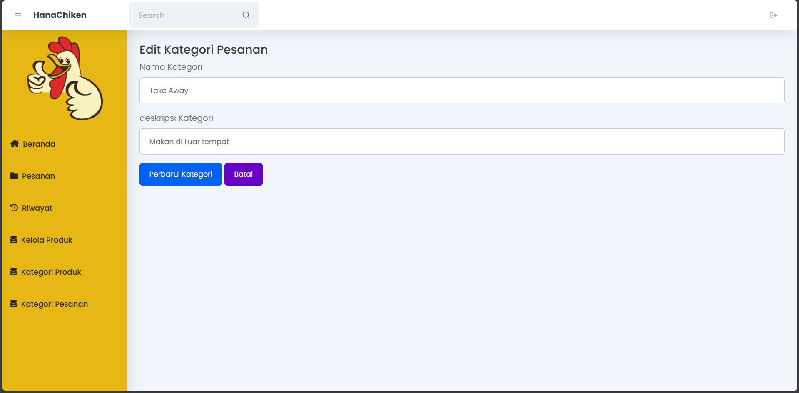

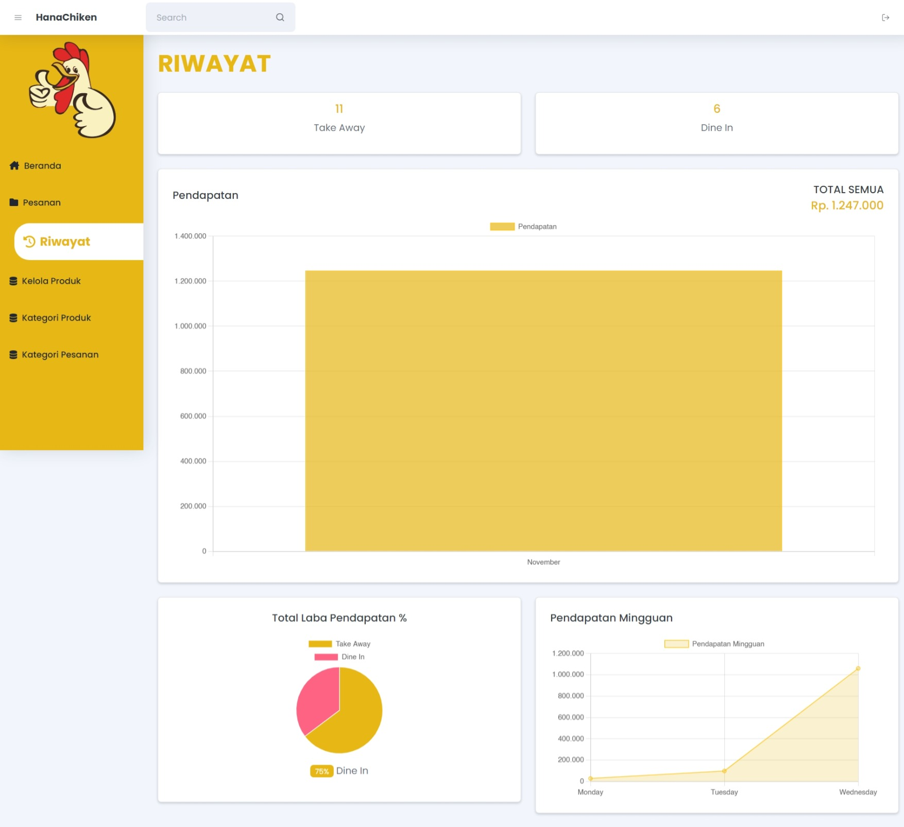

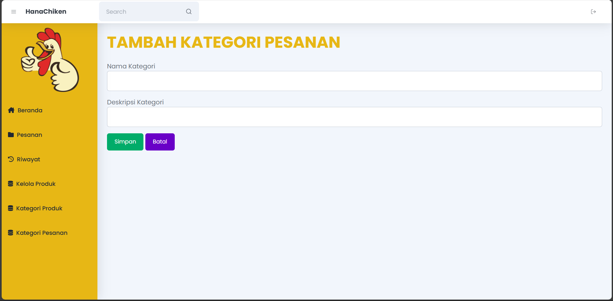

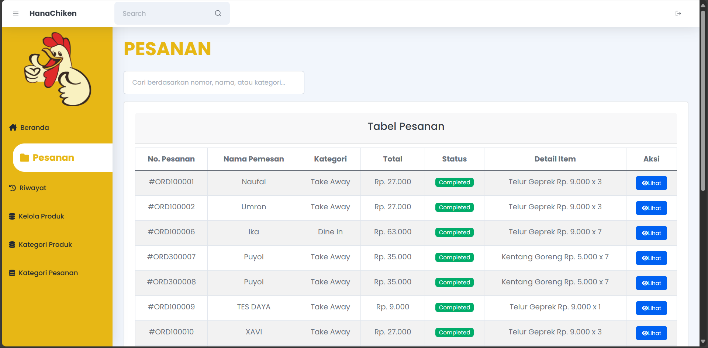

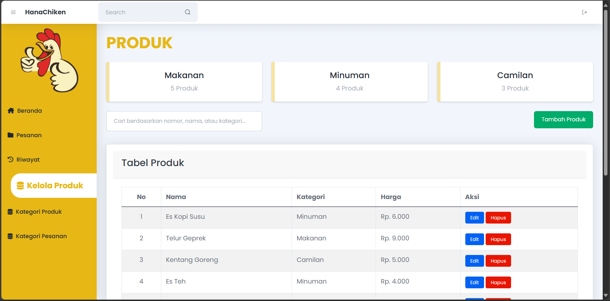

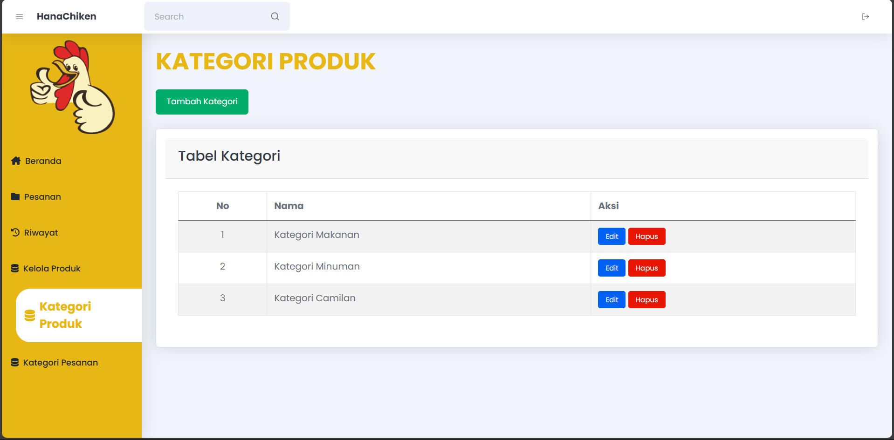

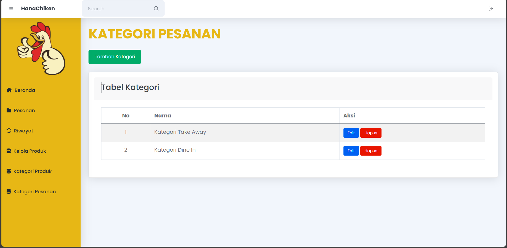

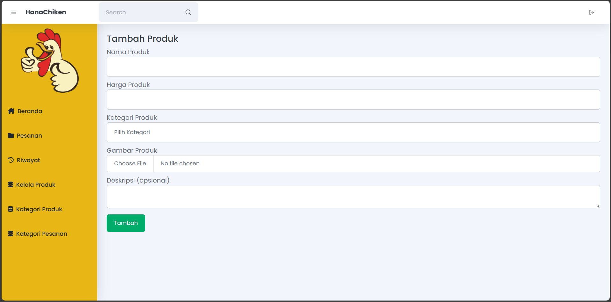

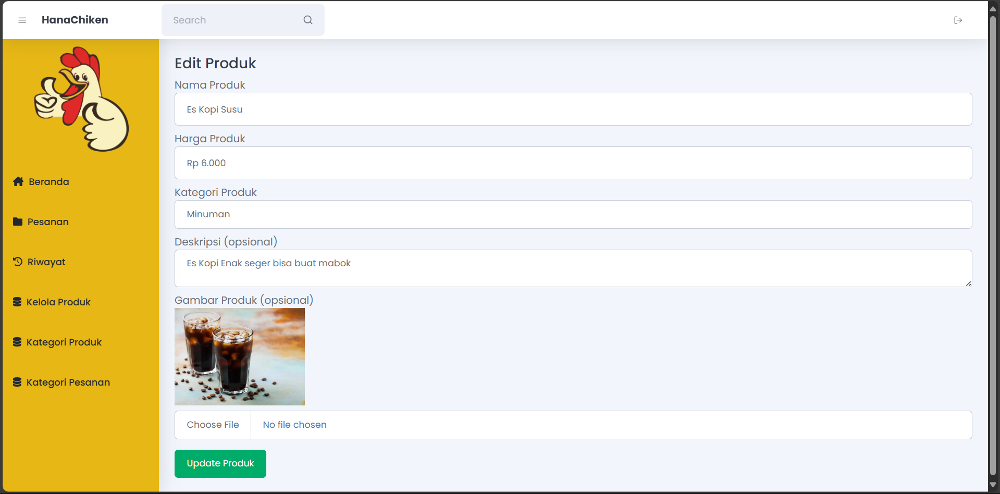

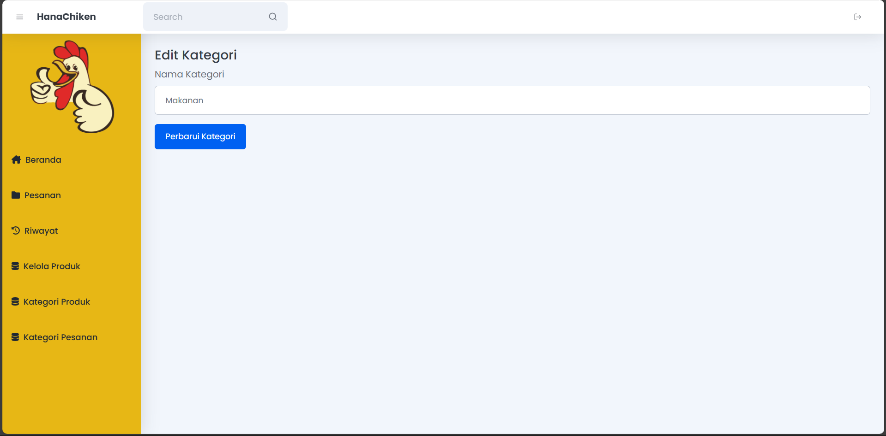

<!-- Sample output -->
# Food Order Appointment System

This project provides an admin system and API for managing food order appointments efficiently.

## Authors

| Name             | Email                      |
|------------------|----------------------------|
| Naufal Developer | tompelart17@gmail.com      |

## License

This project is licensed under the [MIT License](LICENSE).

